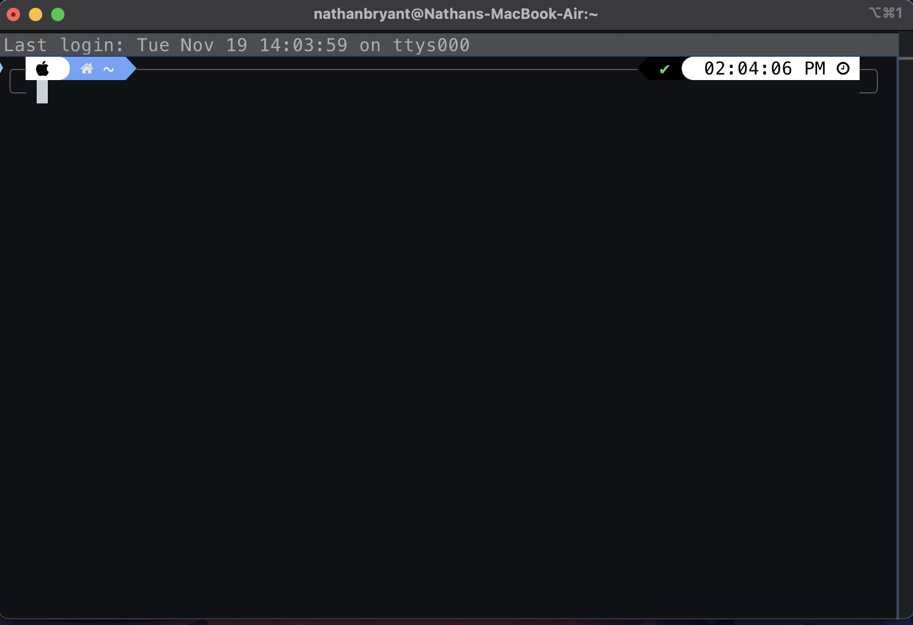
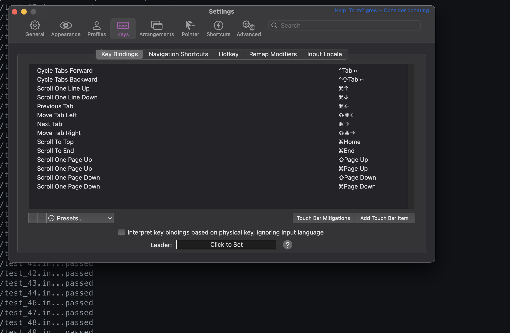
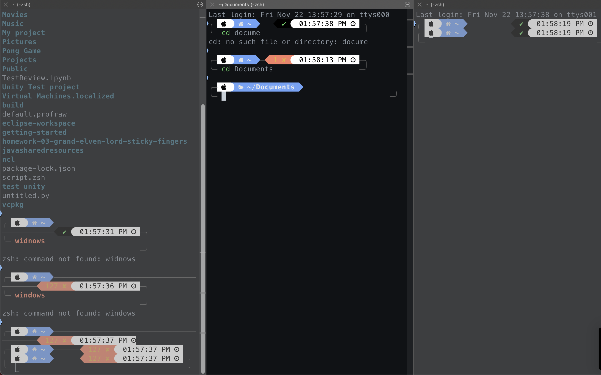

# Working with a New Terminal

I recently decided to switch from the macOS Terminal to **iTerm2** because I wanted a terminal emulator that offered more customization and better usability. As someone who spends a lot of time in the terminal, this is something I find very important. iTerm2 from what I have heard leverages the principle of **matching between the system and the real world**. Its **Split Panes** feature mimics the ability to lay out multiple sheets of paper on a desk or tabs in a notebook for concurrent work—something my old terminal did not support. 

---

## Experience with Split Panes

My primary motivation for switching to iTerm2 from the default terminal was to improve **multitasking efficiency**. I wanted to be able to run multiple commands and monitor their outputs and inputs in parallel. For example, I often need to **SSH** into a server in one pane while keeping my **home directory** open in another pane. For doing things like Secure Copies and some FTP GET's to transfer stuff to a server to my own directory. 

---

## Initial Expectation

From my experience with other software, I expected split panes to work similarly to **screen splitting** on Windows or macOS, where it’s easy to arrange and manage windows. I anticipated being able to run commands in one pane while keeping logs visible in another, much like working with multiple browser tabs or document views. This should be an extremely efficient and easy task. 

---

## Interaction
- After opening up Iterm2, I was greeted with a blank canvas and a working terminal in my home/root directory
- I first believed that it would be CMD + D, which is similar to google chrome or safari, to my avail this was not it.
- I continued trying different keybinds until I gave up and looked in the Shortcuts/accessibility tab.

- 
- I activated the **Split Pane** functionality using the shortcut **COMMAND + SHIFT + D** to split vertically.
- The layout was nice, and the new pane automatically shared the same working directory, which was a very nice touch that my old terminal did not offer.
- Resizing the panes with the mouse felt natural and closely mimicked resizing windows in a browser or web application.

---

## Challenges Encountered

My initial confusion arose when I tried to **navigate between the two panes using keyboard shortcuts**. I was expecting shortcuts like **COMMAND + TAB** or **COMMAND + 1, 2, 3, 4**, similar to browser behavior in Chrome or Safari. However, iTerm2 uses a different shortcut: **COMMAND + OPTION + Arrow Keys**. This will take some learning and adjusting.

---

## Solutions

One of the best features of iTerm2 is its **built-in keybind editor**, which allowed me to reconfigure shortcuts to better suit my preferences.

- I quickly created custom shortcuts that aligned with my mental model and muscle memory, dramatically improving my experience.
- Using **Preferences > Keys**, I customized the pane navigation shortcuts to use **CTRL + Arrow Keys** instead.
- iTerm2 also supports creating custom shortcuts for complex actions, which allows for a **modular approach** to productivity. This flexibility lets me mimic real-world actions, enhancing my workflow further.

---

## Strengths of the Design

### 1. Real-World Analogies

The split panes in iTerm2 feel like **real-world desk organization**, allowing you to group and view tasks simultaneously. This design is natural and `tive. It also emulates the functionality of many other popular programs, making it a staple for power users.

### 2. Visual Cues

iTerm2 provides clear **visual separators** between panes and a subtle highlight to indicate the active pane. This makes it easy to see where you are working. If preferred, these visual cues can be adjusted in the settings.

---

Switching to iTerm2 has significantly improved my productivity and multitasking capabilities. The ability to split panes, customize shortcuts, and mimic real-world workflows makes it an excellent choice for anyone who spends a lot of time in the terminal.
