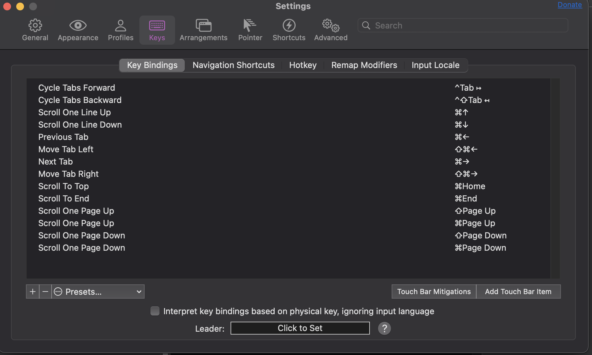

# Working with a new terminal

I recently decided to switch from the macOS Terminal to **Iterm2** because I wanted a terminal emulator that offered more customization and better usability. As someone who spends alot of time in the terminal this is something I find very important. It leverages the principle of matching between system and the real world. It's Split Panes feature mimics this ability to lay out multiple sheets of paper on a desk or tabs in a notebook for concurrent work, something my old terminal did not do. 
insert sheet of paper here --

--------------------
## Experience with split panes:

My primary motivation for switching to iTerm2 from the default is to improve the multitasking effeciency, particularly for being able to run multiple commands and monitor those outputs and inputs in parallel. As well as being able to ssh in one and be in my home directory in the other one. 

--- 
## Initial Expectation:

From other software I have used in the past I would expect it to be much like splitting your screen on windows or mac. And all the while being able to easily arrange them. I anticipated being able to run commands in one pane while keeping logs visible in another, akin to something like multiple browser tabs or document views.

--- 
## Interaction: 

- I activated the Split-pane functionality using the shortcut command COMMAND+SHIFT+D to split vertically
- the layour was intuitive, and the new pane shared the same working directory which is a very nice touch that my old terminal did not do.
- Resizing the panes with the mouse felt natural and closley mimmicked resizing windows in something like a browser or web app

## Challenges Encountered:

- My initial confusion arose when I was trying to navigate between the two panes using keyboard shortcuts. I really was expecting Command + Tab or like Command + 1,2,3,4 kinda like chrome or safari. However, iTerm2 uses a different shortcut they use Command+Option+Arrow, which is gonna take some learning and adjusting too. (Picture Down Below)

## Solutions: 
- What is extremely nice, is that iTerm2 comes with a built- keybind changer, which allowed me to reconfigure shortcuts to better suit my preferences.
- I quickly created custom shortcuts that aligned with my mental model and muscle memory, dramatically improving the experience.
- using the Preferences > Keys menu, I customized my shortcuts ofr pane navigation, making it possible to use ctrl + arrow instead.
- Iterm2 also supports creating custom shortcuts for complex actions, which is nice because this allows for a more modular approach, this is nice because I can mimick real world actions, 

## Strengths of the Design: 
- Real world analogies: The panes feel like a real world desk organization, allowing you to group and view tasks, simulataneousl, which is natural and intuitive. It also emulates alot of different programs and is kind of a staple.
- Visual Cues: clear separators between panes and a subtle highlight make it clear which pane I am actively viewing, although this can be changed in settings if you want ;).

  
